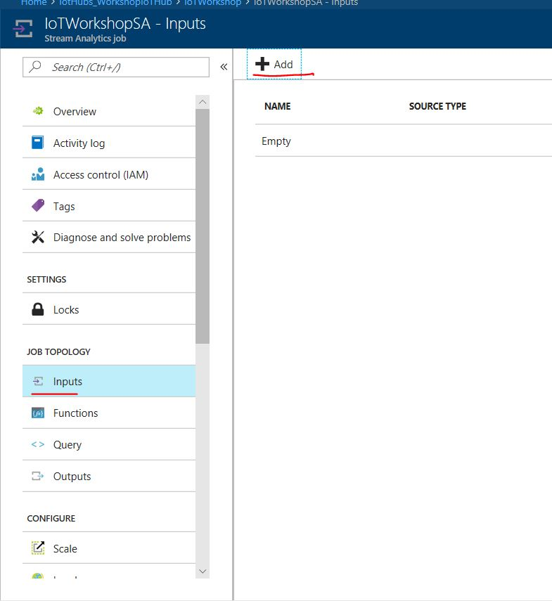
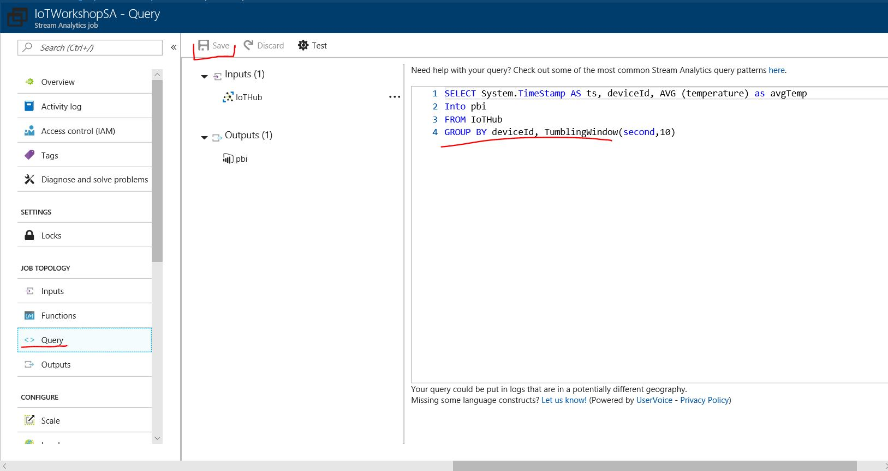
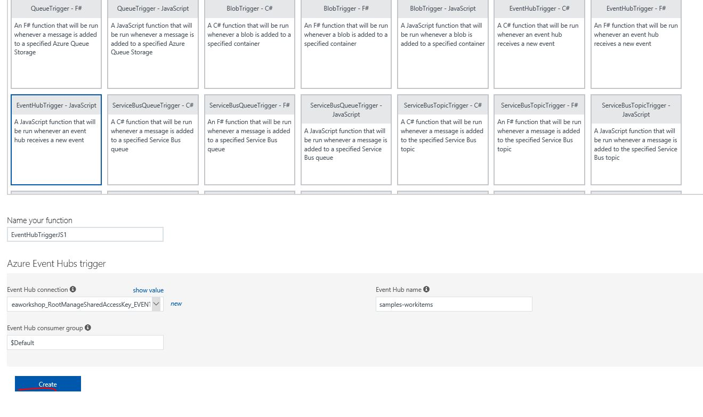
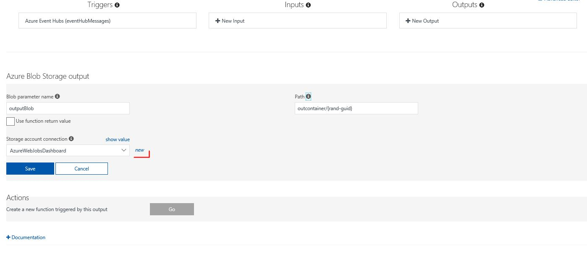

# Azure IoT Workshop - data ingestion, processing and visualization

In this workshop we will utilize multiple Azure services, which enable us to send data from IoT devices to Azure cloud, to process these messages and create data visualization. We will be creating simulated IoT temperature measuring device and subsequently using following Azure Services:

**IoT Hub** - to ingest messages and to send messages/commands back to simulated IoT device

**Azure Stream Analytics** - to perform filtering and near real time processing of messages

**Azure Functions** - to perform extended message processing

**Azure Storage** - for messages archiving

**Power BI** - for real time visualizations

**Blob Storage** - to archive messages

Prerequisite to go thru this lab is existing Azure subscription. If you do not have one, you can easily activate one month trial subscription, in which you get 200$ credit for free. To activate trial subscription visit this page: https://azure.microsoft.com/en-us/free/ 


## 1 Setting up IoT Hub and creating simulated IoT device

To create IoT Hub and simulated IoT Device, which connect to IoT Hub, please choose preferred language and follow tutorial:

**C#**: https://docs.microsoft.com/en-us/azure/iot-hub/iot-hub-csharp-csharp-getstarted

**Java**: https://docs.microsoft.com/en-us/azure/iot-hub/iot-hub-java-java-getstarted

**Node.js**: https://docs.microsoft.com/en-us/azure/iot-hub/iot-hub-node-node-getstarted

**Python** (not recommended for this workshop as it does not allow to implement cloud to device communication thru SDK):  https://docs.microsoft.com/en-us/azure/iot-hub/iot-hub-python-getstarted


## 2 Sending Cloud to Device (C2D) messages

Besides receiving of messages Azure IoT Hub also allows you to send messages/commands to connected IoT devices. In this part you will implement this functionality. Please again pick preferred language and follow tutorial

**C#**: https://docs.microsoft.com/en-us/azure/iot-hub/iot-hub-csharp-csharp-c2d

**Java**: https://docs.microsoft.com/en-us/azure/iot-hub/iot-hub-java-java-c2d

**Node.js**: https://docs.microsoft.com/en-us/azure/iot-hub/iot-hub-node-node-c2d


# 3 Exploring IoT Hub with Device Explorer

Device explorer is tool, which gives you visibility to what is going on with your IoT Hub. What devices are registered, you can manage devices register/revoke, monitor incoming messages  and send messages to devices. You can download zip with exe file from this location [https://1drv.ms/u/s!AjuEJLX_rHMSibguG9rHtmbuerru_A](https://1drv.ms/u/s!AjuEJLX_rHMSibguG9rHtmbuerru_A) . When downloaded, extract and run deviceexplorer.exe . If you are not running Windows environment on your machine, you can use CLI tool called IoTHub explorer to accomplish this part. You can get it as a npm package: https://www.npmjs.com/package/iothub-explorer

1. Locate and copy connection string with owner permission to your IoTHub from Azure portal

   

2. Paste to device explorer app and click update

   

3. Explore Management tab - here you can see already registered devices together with their keys. You can also register new ones

   

4. Explore Data tab - start simulated devices application to initiate sending of messages to IoT Hub. Click monitor button and you should see messages being sent to IoT Hub. **Note:** Do not run message reading application as it would hi jack messages from IoT Hub as it uses the same default consumer group.

   

5. Explore Messages to Device card - here you can copy the payload from cloud to device sending application and hit send. Your simulated device will receive it.

   


## 4 Creating Power BI account 

For further needs we will create Power BI account. Power BI is Business Intelligence visualization tools, which provides rich data visualization capabilities across various scenarios, not necessarily only for business data. To create account follow these steps:

1. Navigate to http://www.powerbi.com

2. Hit *"Start free"* button

   

3. Activate Power BI Pro 60 day free trial by clicking *"TRY FREE"* button

   

   ​

4. Provide work email address (Note: outlook, gmail, yahoo etc. address won't work), hit Sign up and finish registration process

   


## 5. Create and configure Azure Stream Analytics to perform real time processing

In this step we will create Azure Stream Analytics Job, which enables us to examine high volumes of data streaming from devices or processes, extract information from that data stream, identify 
patterns, trends, and relationships. These patterns can be subsequently used to trigger other
 processes or actions, like alerts, automation workflows, feed information to a reporting tool, or store it for later investigation.  

Before we start with the creation of Stream Analytics Job we will alter configuration of our IoT Hub and we will create new Consumer groups, so our services, which read messages from IoT Hub do not hi-jack those to each other. To add consumer groups follow these steps:

1. Navigate to your IoT Hub in Azure Portal

2. Click Endpoints, select Events and add "*StreamAnalytics*" and "Functions" consumer group and finally hit Save.

   

#### Creating Azure Stream Analytics Job:

1. Navigate to Azure Portal

2. Hit Create Resource, navigate to Internet of Things category of services and select Stream Analytics Job

   

3. Give name to your Stream Analytics Job, select Resource group (preferably the same one you that you have created IoT Hub in) and hit Create. This will start provision of your Stream Analytics resource, what should take few seconds

   

#### Configure Azure Stream Analytics Job to receive messages from IoT Hub, process them and output to Power BI as a streaming dataset for real time visualization

1. First we will need to create Input. To do so, navigate to newly created Azure Stream Analytics job, select Inputs and click Add.

   

   ​

2. In New Input form provide Input alias as IoTHub, set Source to IoT hub, choose IoT hub you have created in first part of this lab, and change Consumer group from $default to "*streamanalytics*" and hit Create.

   

3.  Now we will add Power BI output. This is why we have activated Power BI account and did not continued with data visualization yet. First we need to interconnect Stream Analytics with our Power BI account. To achieve this navigate again to Azure Stream Analytics Job and click Output and New.

   

4. Name your output *"pbi"* and select PowerBI for output type. Also notice different output types, that Stream Analytics provides.

   

5. In next step hit Authorize and in Sign in page use Power BI credentials you have created.

   

6. Fill in details for streaming dataset that will be output from Stream Analytics to Power BI. Group Workspace should be left as is set to My Workspace. Set Dataset Name field to *"IoTWorkshop"* and Table Name to *"Temperatures"* and hit Create.

   

7.  As last step we need to create Query which determines how the incoming messages will be processed. Essentially we will read the message and we will use average aggregation function on top of the time windows with size of 10 seconds. In other words we will calculate temperature average over 10 seconds window and we will output these values to Power BI. To do so, navigate to Azure Stream Analytics Job, click Query and you will be displayed editor, where you can define queries.

   

8. Insert following code to query window and hit Save.

   ```sql
   SELECT System.TimeStamp AS ts, deviceId, AVG (temperature) as avgTemp   
   Into pbi
   FROM IoTHub
   GROUP BY deviceId, TumblingWindow(second,10)
   ```

9. We are done configuring Azure Stream Analytics Job and now we only need to run it. To achieve that navigate to Overview of your job and hit Run and select Now and Start.

   

   ​

   

   ​

We have create relatively simple query, which creates average value of temperature. Azure Stream Analytics however provides much more sophisticated querying capabilities. You get examine those in documentation: 

Azure Stream Analytics Windowing: https://msdn.microsoft.com/en-us/library/azure/dn835019.aspx

Azure Stream Analytics Aggregation Functions: https://msdn.microsoft.com/en-us/library/azure/dn931787.aspx

Azure Stream Analytics Common Usage Patterns: https://docs.microsoft.com/en-us/azure/stream-analytics/stream-analytics-stream-analytics-query-patterns


## 6. Real Time Visualization with Power BI

Now we are missing the last step to have the whole data flow configured. We have worked on data ingestion, processing, and now we need to setup visualization part. To do so, we utilize Power BI. Before we start please run your IoT device simulator application so it generates messages which will flow thru IoT Hub, Stream Analytics Job down to Power BI. 

1. Navigate to http://ww.powerbi.com and sign in using your credentials

   

2.  Open "*My Workspace*" and scroll down to DATASETS where you should see IoTWorkshop dataset 

   

3. Click "*My Workspace*" hit Create in right upper corner and select Dashboard

   

4. Name your Dashboard and click Create

   

5. In next step click Add tile and then select CUSTOM STREAMING DATA and proceed by clicking Next

   

6. Select IoTWorkshop streming dataset and hit Next

   

7. In this step we will define how the visualization will look like. We set Line chart as a Visualization Type. For Axis we will choose ts field (timestamp) and avgtemp for Values. We will display window for last 5 minutes. Proceed by clicking Next

   

8. Now we will provide Title for out visualization, click Apply, and we are able to observe average temperature measured by our simulated device in almost real time.

   

9. Visualization of data should look something like this:

   

   ​

Similar as other services we worked with today also Power BI provides much richer set of functionality as we were able to touch in our lab. Power BI enables you to create and share data visualization of various kind from various data sources, whether it is relational, non relational, nosql or simple csv file store in your datacenter, in Azure or in other clouds. To find out more about this service please visit: https://powerbi.microsoft.com/en-us/documentation/powerbi-service-get-started/

## 7. Adding extended message processing

Often times real time processing capabilities of SQL like language, which is offered by Stream Analytics are not enough. Stream Analytics is meant for quick data filtering, but your scenario may require to implement some sort of procedural processing logic. You can achieve that for example with using serverless component Azure Functions. To demonstrate this service, we will extend our project by adding intermediate  queue in form of Azure Event Hub, which will be new output for our Stream Analytics Job, subsequently we will create Azure Functions, which will get activated by incoming messages to Event Hub. In our case this function will not carry any processing logic, it will be simply used for message archiving and it will write to Blob Storage account. However in your scenarios this maybe space to implement your own data processing logic, which is specific to your application.

#### Creation of Event Hub

To create event hub, please follow these steps:

1. Click + Crate a resource, go to Internet of Things, choose Event Hubs and finally click create

   

2. Choose unique name for your namespace, Set pricing tier to Basic, select your resource group and Location to West Europe and hit create.

   

3. Now we have created namespace for our future event hubs, and now we need to create event hub instance. To do so navigate to newly created resource and hit + Event Hub

   

4. Name your eventhub and click create

   


#### Add Event Hub output to Stream Analytics Job

Now that you have create Event Hub, we can alter Azure Stream Analytics job to send messages to this event hub. First we need to add output to Stream Analytics. To do so navigate to Stream Analytics -> Outputs (Note: to later job you need to stop it first). Click Add Output and set output to point to your previously create Event Hub: 


Subsequently you can alter the job script itself like this:

```sql
SELECT System.TimeStamp AS ts, deviceId, AVG (temperature) as avgTemp   
Into pbi
FROM IoTHub
GROUP BY deviceId, TumblingWindow(second,10) 

SELECT System.TimeStamp AS ts, deviceId, temperature, humidity 
Into eventHubOutput
FROM IoTHub
```

Now you can start the job again

#### Creating Azure Function

To create Azure functions which will get activated by incoming messages to Event Hub follow this procedure:

1. Click Create a resource, choose Compute, select Azure Functions, provide unique name, use existing resource group and set location to the location where you are running other services. Hit Create.

   

2. Now when your Functions resource is created navigate to it and expand it in the list of Functions Apps, click Functions and then New function

   

3. Select EventHubtrigger - Javascript and bellow click new to add connection to our Event Hub

   

4. Choose namespace and event hub and click Select

   

5. After that just click Create

   

6. In the next step we will create Output binding for our function in form of storage blob, where we will output/archive incoming messages. To do so, click Integrate and New Output

   

7. Select Azure Blob Storage

   

8. Click new to connect to our Blob Storage, which was created together with the Function resource

   

9. Select the storage account (note that the name was generated automatically and it will be different for you)

   

10. After selecting Storage account just click Save

    

11. As a last point we need to alter the code of the function slightly. Navigate to your the code of the functions and you will see that there was already some code pre-generated. We need to alter it  so it writes to output blobs. 

    

    Alter the function's code like this:

    ```javascript
    module.exports = function (context, eventHubMessages) {
      context.log('JavaScript eventhub trigger function called for message array ${eventHubMessages}');
      eventHubMessages.forEach(message => {
          context.log('Processed message ${message}');
          context.bindings.outputBlob = message;
      });

      context.done();
    };

    ```
    Now when you start your simulated application, you will see how to function get activated and you can watch that in output window within Azure Portal. You can verify, that it works by navigating to your storage account and using Browse Blobs feature. In the outcontainer you should see create blobs which contain incoming messages.

    

    Alternatively you can use Storage Explorer tool to browse your storage account. You can download it here (for Windows/Mac/Linux): https://azure.microsoft.com/en-us/features/storage-explorer/ 


## Conclusion

Congratulation you have now completed the whole Lab and you were able to get started with several Azure Services that are suitable for implementing IoT Scenarios, more specifically ingress, processing and visualization of data. Bellow we are adding some useful links related to the services we have touched. All these services provide a lot more functionality, than we were able to touch in this lab so we encourage you to go thru the resources and explore even more advanced capabilities of these services.